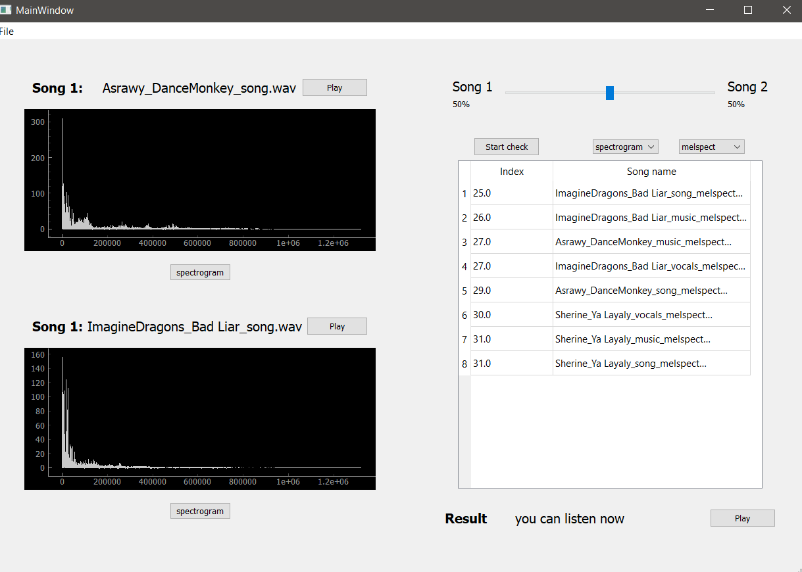
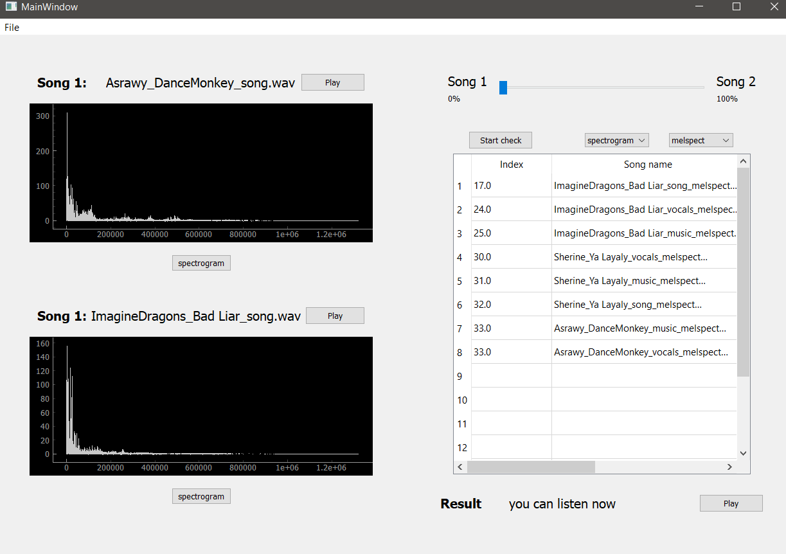
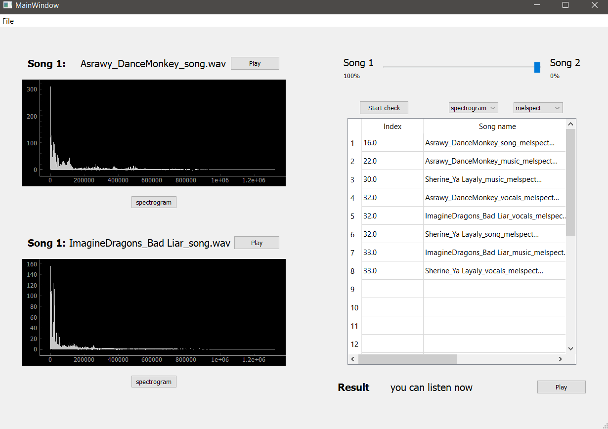
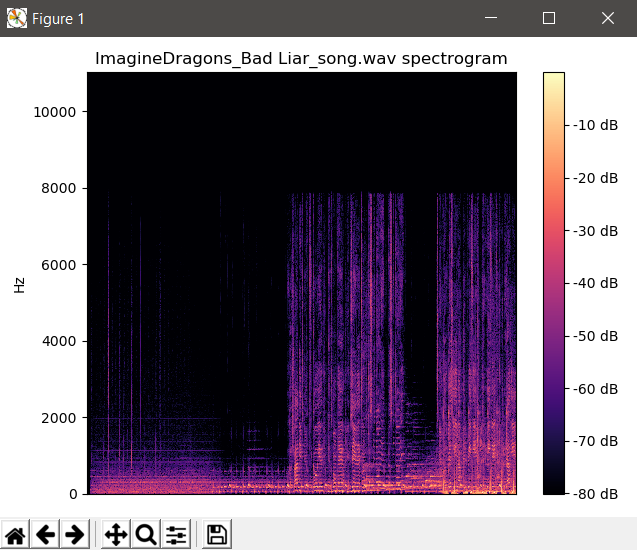
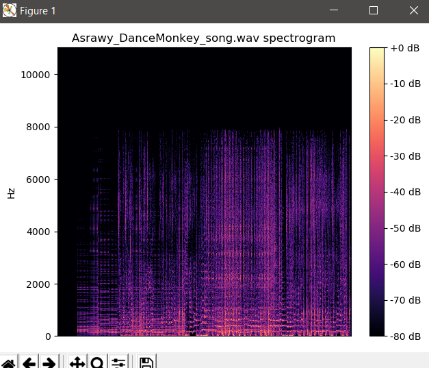

### Names:
* Remon Albear
* Mohammed Almotasem
*  Ahmed Adel 
# Contents:
<!-- MarkdownTOC -->
- [Contents:](#contents)
- [Shazam](#shazam)
- [Files written:](#files-written)
- [Results:](#results)
    - [Screenshots to the program:](#screenshots-to-the-program)

<!-- MarkdownTOC -->
# Shazam 
 Our application simulates real-life programs like shazam that helps the user in finding a certain song or melody that he/she is looking for by comparing an input audio given by the user that is related to the required song, Our application then runs a certain algorithm that handles the frequencies of the input and compares it to our database in order to find the required song

# Files written:
* gui.py : it contains the GUI design created by the Qt designer
* shazam.py : the file contains the program class that handles the comparison between the input and he database
* script.py : a file contains an algorithm that reads the songs and create it's spectrogram and features
* dist folder: it contains the executable version of our shazam program from there a user can run the program in a friendly way

# Results:
The program results are considered satisfying as it preserves the goal of giving the nearest song or melody found on the database by checking the similarity (ie. taking the difference) between the input spectrogram and those in the database and choosing the most similar one to the input

### Screenshots to the program:

* Spectrograms:
  
   

